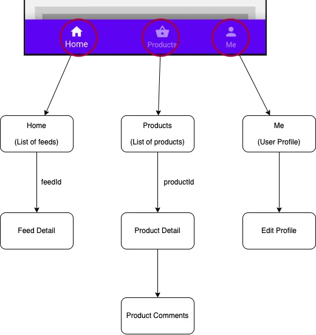

### Routes And Navigation

When it comes to routing from a widget which has a Navbar setup it is important to decide whether the Navbar should persist on pushing a new route or not. If the Navbar needs to be hidden then the route should be pushed onto the Flutter's Navigation stack (on top of NavbarRouter). But if we want the Navbar to persist then we should push the route ontop of the existing route (Within NavbarRouter).

NavbarRouter uses this approach by Wrapping each NavbarItem with a [Navigator](https://api.flutter.dev/flutter/widgets/Navigator-class.html) and pushing the route ontop of the existing route.

Consider a rough diagram of a sample app with 3 Navbar items and each item has a nested routes.



So we need to declare a Map of routes as follows

```dart
  final Map<int, Map<String, Widget>> _routes = const {
    0: {
      '/': HomeFeeds(),
      FeedDetail.route: FeedDetail(),
    },
    1: {
      '/': ProductList(),
      ProductDetail.route: ProductDetail(),
      ProductComments.route: ProductComments(),
    },
    2: {
      '/': UserProfile(),
      ProfileEdit.route: ProfileEdit(),
    },
    3: {
      '/': Settings(),
    },
  };
```

The key of the outer Map is the index of the NavbarItem. The key of the inner Map is the route name and the value is the Widget to be displayed.

### Pushing Routes within NavbarItem (Persists Navbar by default)

**A helper method `navigate` is built within NavbarRouter to push routes**

Setting the `isRootNavigator` to `false` will push the route ontop of the existing route (Within NavbarRouter)

```dart
 navigate(context, ProductDetail.route,
  isRootNavigator: false,
  arguments: {'id': index.toString()}
);
```
> Note that you can still choose to hide the Navbar by calling `NavbarNotifier.hideNavbar = true`.

### Pushing Routes on top of NavbarRouter

if you want to push a router on top of NavbarRouter you simply need to set the `isRootNavigator` to `true` (default)

```dart
 navigate(context, ProductDetail.route,
  isRootNavigator: true,
  arguments: {'id': index.toString()}
);
```

