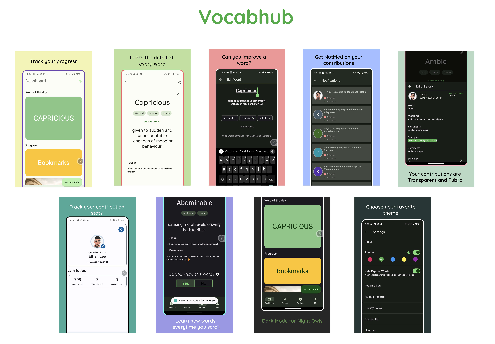

## ShowCase

`navbar_router` was built to make it easy to create beautiful and highly customizable navigation bars in Flutter. Here are some of the Apps that are using `navbar_router` in production.

### [Vocabhub](https://play.google.com/store/apps/details?id=com.vocabhub.app)

***Vocabhub is a crowd-sourced vocabulary app designed to help users enhance their vocabulary and language skills. It offers a curated collection of common GRE words, fosters community-driven learning, and provides a personalized learning experience***

> If you are a Indie App Developer or a Company using navbar_router and want to showcase your Beautiful App, please ping me on Twitter or open an issue on GitHub. I would love to add your App to the Showcase.
